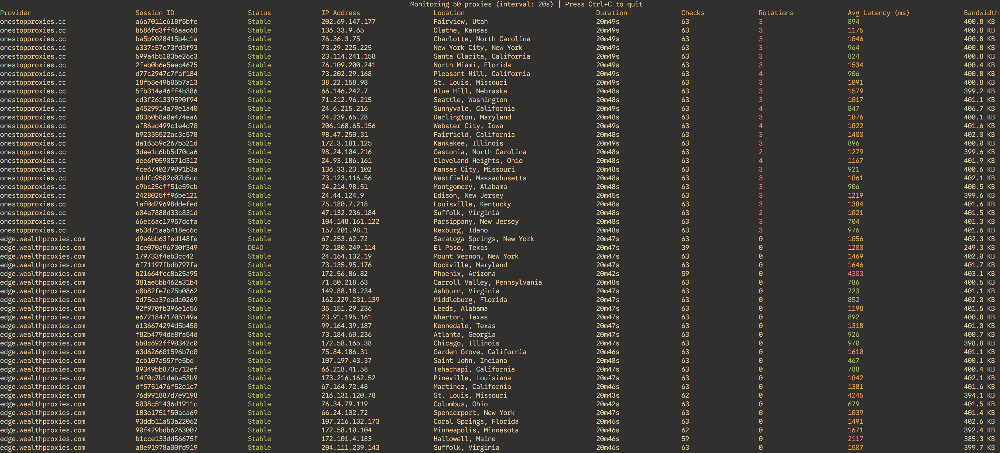

# Proxy Session Tester

A TUI application for monitoring proxy sessions with real-time status tracking.



## Features

- Monitors multiple proxies concurrently with configurable check intervals
- Supports IP-authenticated (host:port) and user/pass (host:port:user:pass) proxy formats
- Tracks IP rotation, session duration, latency, and bandwidth usage
- Detects duplicate IPs across sessions

## Build

```bash
go build
```

## Usage

```bash
./proxy-session-tester -proxies proxies.txt -interval 20 -stagger 50
```

### Flags

- `-proxies` - Path to proxies file (default: proxies.txt)
- `-interval` - Check interval in seconds (default: 20)
- `-stagger` - Delay between starting each proxy monitor in milliseconds (default: 50)

### Proxies File Format

One proxy per line:
```
host:port
host:port:username:password
```

Lines starting with `#` are ignored.
